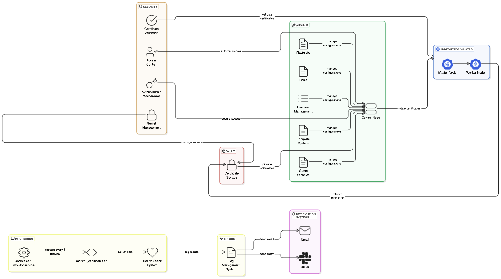

# Kubernetes Certificate Rotation with Ansible

This Ansible project automates the process of rotating Kubernetes certificates that are stored in Hashicorp Vault. The project includes monitoring, notification, and rotation capabilities.

## Architecture Diagram

The following diagram illustrates the system architecture and component interactions:



## Prerequisites

- Ansible 2.9 or higher
- Hashicorp Vault access
- Kubernetes cluster access
- Slack webhook URL (for notifications)
- Splunk monitoring setup
- Systemd-based Linux system (for automatic monitoring)

## Monitoring Server Requirements

The monitoring system should be deployed on a dedicated server with the following specifications:

### Hardware Requirements
- Minimum 2 CPU cores
- 4GB RAM
- 20GB storage

### Software Requirements
- Linux distribution with systemd (Ubuntu 20.04 LTS or RHEL 8+ recommended)
- Python 3.8 or higher
- Ansible 2.9 or higher
- OpenSSL
- Network connectivity to:
  - Hashicorp Vault
  - Kubernetes cluster
  - Splunk
  - Slack API
  - SMTP server (if using email notifications)

### Network Requirements
- Outbound access to:
  - Hashicorp Vault (default: 8200)
  - Kubernetes API (default: 6443)
  - Splunk (default: 8089)
  - Slack API (443)
  - SMTP server (if using email notifications)
- Firewall rules to allow these connections

### Security Requirements
- Secure storage for credentials
- Regular security updates
- Network isolation (recommended)
- Access control for monitoring server

## Project Structure

```
.
├── inventory/
│   └── hosts.yml
├── group_vars/
│   └── all.yml
├── roles/
│   ├── certificate_monitor/
│   │   └── tasks/
│   │       └── main.yml
│   ├── certificate_rotation/
│   └── notification/
│       └── tasks/
│           ├── slack.yml
│           └── email.yml
├── playbooks/
│   ├── rotate_certificates.yml
│   ├── monitor_certificates.yml
│   └── setup_monitoring.yml
├── monitor_certificates.sh
├── ansible-cert-monitor.service
└── requirements.yml
```

## Deployment

1. Choose a suitable monitoring server that meets the requirements above.

2. Clone the repository to the monitoring server:
```bash
git clone <repository-url>
cd kubernetes-cert-rotation
```

3. Update the `PROJECT_PATH` in `monitor_certificates.sh` to point to your project directory:
```bash
PROJECT_PATH="/path/to/your/project"
```

4. Configure the environment:
```bash
# Install required packages
sudo apt update
sudo apt install -y python3-pip ansible openssl

# Install required Python packages
pip3 install -r requirements.txt
```

5. Run the setup playbook:
```bash
ansible-playbook playbooks/setup_monitoring.yml
```

6. Verify the monitoring service is running:
```bash
systemctl status ansible-cert-monitor.timer
```

## Configuration

1. Update `inventory/hosts.yml` with your Kubernetes cluster details
2. Configure variables in `group_vars/all.yml`:
   - Vault credentials
   - Slack webhook URL
   - Certificate paths
   - Notification settings
   - Email configuration (if using email notifications)

## Usage

### Manual Certificate Monitoring
```bash
ansible-playbook playbooks/monitor_certificates.yml
```

### Certificate Rotation
```bash
ansible-playbook playbooks/rotate_certificates.yml
```

### Setting Up Automatic Monitoring

1. Update the `PROJECT_PATH` in `monitor_certificates.sh` to point to your project directory.

2. Run the setup playbook:
```bash
ansible-playbook playbooks/setup_monitoring.yml
```

This will:
- Create necessary log files and directories
- Install the monitoring script
- Set up a systemd service and timer
- Enable and start the monitoring service

### Monitoring Service Management

Check service status:
```bash
# Check service status
systemctl status ansible-cert-monitor.service

# Check timer status
systemctl status ansible-cert-monitor.timer

# View logs
tail -f /var/log/cert-monitor.log
```

Control the monitoring service:
```bash
# Stop monitoring
sudo systemctl stop ansible-cert-monitor.timer

# Start monitoring
sudo systemctl start ansible-cert-monitor.timer

# Disable monitoring
sudo systemctl disable ansible-cert-monitor.timer

# Enable monitoring
sudo systemctl enable ansible-cert-monitor.timer
```

## Features

- Automated certificate monitoring via Splunk and direct Vault validation
- Automatic monitoring every 5 minutes using systemd timer
- Slack and email notifications 5 days before certificate expiration
- Automated certificate rotation using Ansible
- Team notification after successful rotation
- Integration with Hashicorp Vault for secure certificate storage
- Comprehensive logging and error handling
- Automatic retry mechanism for failed checks
- Prevention of multiple monitoring instances

## Monitoring System Details

The monitoring system includes:

1. **Automatic Execution**:
   - Runs every 5 minutes using systemd timer
   - Starts automatically on system boot
   - Handles failures and retries

2. **Error Handling**:
   - Retries up to 3 times on failure
   - 60-second delay between retries
   - Prevents multiple instances from running simultaneously

3. **Logging**:
   - Logs all activities to `/var/log/cert-monitor.log`
   - Includes timestamps and detailed error messages
   - Maintains execution history

4. **Dual Monitoring Approach**:
   - Direct certificate validation from Hashicorp Vault
   - Splunk integration for additional monitoring and historical data
   - Combined results for comprehensive certificate status

5. **Health Monitoring**:
   - Continuous monitoring of the monitoring system itself
   - Checks for:
     - Service status
     - Timer status
     - Recent errors in logs
     - Service execution duration
   - Automatic notifications for:
     - Service failures
     - Timer issues
     - Error detection
     - Long-running processes
   - Health checks run every 5 minutes
   - Notifications via Slack and/or email

### Health Check Notifications

The system will send notifications in the following scenarios:

1. **Service Status Issues**:
   - Service not running
   - Timer not active
   - Service running too long (>5 minutes)

2. **Error Detection**:
   - Recent errors in logs
   - Failed health checks
   - Monitoring system failures

3. **Notification Format**:
   - Detailed error messages
   - Specific issues identified
   - Timestamp of the problem
   - Recommended actions

### Manual Health Check

You can manually check the monitoring system health:
```bash
ansible-playbook playbooks/check_monitoring_health.yml
```

This will:
- Check service and timer status
- Review recent logs for errors
- Verify execution times
- Send notifications if issues are found

## Security Guidelines

### Sensitive Data Handling

This project contains sensitive information that should be handled carefully:

1. **Never commit sensitive data**:
   - Vault tokens
   - Slack webhook URLs
   - SMTP credentials
   - Splunk credentials
   - Kubernetes cluster credentials
   - Private keys and certificates

2. **Use template files**:
   - Copy `group_vars/all.yml.template` to `group_vars/all.yml`
   - Update with your specific values
   - Never commit the actual `all.yml` file

3. **Credential Storage**:
   - Store sensitive credentials in Hashicorp Vault
   - Use environment variables for local development
   - Never hardcode credentials in playbooks

4. **File Permissions**:
   - Set appropriate permissions for credential files
   - Restrict access to log files
   - Use secure file ownership

5. **Network Security**:
   - Use HTTPS for all API communications
   - Implement proper firewall rules
   - Use secure ports for services

### Best Practices

1. **Version Control**:
   - Use `.gitignore` to exclude sensitive files
   - Never commit real certificates or keys
   - Use template files for configuration

2. **Access Control**:
   - Implement role-based access control
   - Use service accounts with minimal privileges
   - Regular audit of access permissions

3. **Monitoring**:
   - Enable audit logging
   - Monitor access to sensitive files
   - Regular security reviews

4. **Updates**:
   - Keep all dependencies updated
   - Regular security patches
   - Review security advisories
